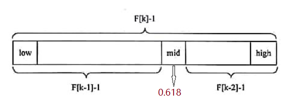
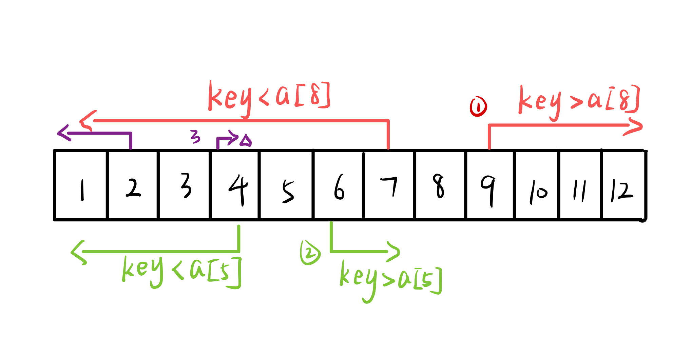
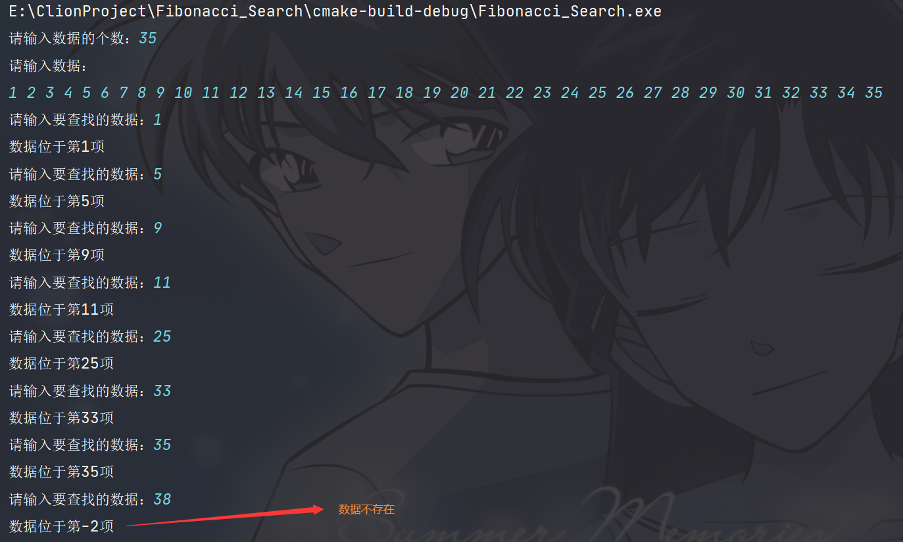

### 浅谈：斐波那契搜索算法（Fibonacci search）


#### 一：有趣的背景

​		谈到斐波那契查找算法，总是有一个神奇的数字与之紧密相连——黄金分割数（0.618）。黄金分割数被公认为最具有审美意义的比例数字，这个数值的作用不仅仅体现在诸如绘画、雕塑、音乐、建筑等艺术领域，而且在管理、工程设计等方面也有着不可忽视的作用。在斐波那契数列中，也存在着黄金分割数的身影。我们不妨在斐波那契数列中寻找一下它的身影。

> 斐波那契数列：0 1  1 2 3 5 8 13 21 34 55 89 144 233 377.....
>
> 1/2 = 0.5；	2/3 = 0.667；	3/5 = 0.6
>
> 5/8 = 0.625；	8/13 = 0.615；	13/21 = 0.619
>
> 21/34 = 0.617；	34/55 = 0.618；......

​		所以在斐波那契数列的指引下，通过斐波那契查找算法分割时，分割后的两段也会呈现出黄金分割的特点（这可真是计算机大佬们的硬核审美啊~~），但是人们发明这个算法可并不是为了好看，一定是有它的优点，这留到我后面再说。




#### 二：算法原理

##### 1. 前提条件

首先我们得知道，斐波那契查找算法是**折半查找算法的一个提升算法**，所以它以一定要在折半查找的前提下进行。所以，要使一个表能够用斐波那契查找，首先它得是一个**顺序存储的有序表**。


##### 2. 算法描述（设有序表为a）

​    斐波那契查找是依据斐波那契序列的特点对表进行分割的。假设开始时表中记录的个数(不妨设为n)比某个斐波那契数(F<sub>u</sub>)小1，即 **n = F<sub>u</sub> - 1**（这也是一个前提条件），然后将给定值 key 和 a[F<sub>u-1</sub>] 进行比较

- 若相等，则查找成功
- 若key < a[F<sub>u-1</sub>] ，则继续在 a[1] 至 a[F<sub>u-1</sub> - 1] 的子表中进行查找
- 若key > a[F<sub>u-1</sub>] ，则继续在 a[F<sub>u-1</sub> + 1] 至 a[F<sub>u</sub> - 1] 的子表中进行查找。该子表的长度为 F<sub>u-2</sub> - 1


##### 3. 算法剖析



为了更加直观的理解斐波那契查找的过程，我们借助上图进行一个简单的分析，按①~③的顺序。

首先我们生成一个斐波那契数列： F<sub>1</sub> = 1,   F<sub>2</sub> = 1，  F<sub>3</sub> = 2，  F<sub>4</sub> = 3，  F<sub>5</sub> = 5，  F<sub>6</sub> = 8，  F<sub>7</sub> = 13；

然后我们设，有序表a, 从a[1]~a[12] 的值为 1 ~ 12。（为了方便理解，储存该表的数组的a[0]为空）

我们假定，需要查找的数为key = 4。

因为 n = F<sub>u</sub> - 1 ，可以知道此时，**u = 7**。将key和a[F<sub>7-1</sub>] （即a[8]）进行比较，我们发现key<a[8]。

然后在a[1]~a[7]中进行查找，此时**u = 6**。将key和a[F<sub>6-1</sub>]（即a[5]）进行比较，我们发现key<a[5]。

然后再a[1]~a[4]中进行查找，此时**u = 5**。将key和a[F<sub>5-1</sub>]（即a[3]）进行比较，我们发现key>a[3]。

此时只剩a[4]，查找完毕。

##### 4. 算法优点

斐波那契查找的平均性能比折半查找好，但最坏情况下（虽然时间复杂度仍为O(logn)）的性能却比折半查找差。它还有一个有点就是分割时只需加减运算，而二分法需要除2.


#### 三：算法实现

```c
// Fibonacci_Search.c

#include <stdio.h>

#define MAX_SIZE 20
#define MAX 100

// ----构造斐波那契数列-----
void Fibonacci(int *F) {
    F[0] = 0;
    F[1] = 1;
    for (int i = 2; i < MAX_SIZE; ++i) {
        F[i] = F[i - 1] + F[i - 2];
    }
}

//----斐波那契查找算法------
int Fibonacci_Search(int *a, int n, int key) {     //a为需要查找的数组，n为a的长度，key为要查找的数
    int F[MAX_SIZE];
    Fibonacci(F);
    int u = 0;
    while (n > F[u]) {						//计算n位于斐波那契数列的位置
        u ++;
    }
    for (int i = n; i < F[u] - 1; ++i) {	//如果n < F[u] - 1,则用数组最后一个数补位，直到n = F[u] -1
        a[i + 1] = a[i];
    }
    int low = 1;
    int high = n;
    while (low <= high) {
        int mid = low + F[u - 1] - 1;
        if (mid > n && a[n] == key) {		//若mid>=n则说明是扩展的数值,返回n
            return n;
        } else if (mid > n){
            return -2;						//查找的数据不存在
        }
        if (key == a[mid]) {
            return mid;
        } else if (key > a[mid]) {
            low = mid + 1;
            u -= 2;
        } else if (key < a[mid]) {
            high = mid - 1;
            u--;
        }
    }
    return -2; 								//查找的数据不存在
}

int main() {
    int F[MAX_SIZE];
    Fibonacci(F);
    int a[MAX];
    int n;
    printf("请输入数据的个数：");
    scanf("%d", &n);
    printf("请输入数据：\n");
    for (int i = 1; i <= n; ++i) {
        scanf("%d", &a[i]);
    }
    int key;
    printf("请输入要查找的数据：");
    scanf("%d", &key);
    int answer = Fibonacci_Search(a, n, key);
    printf("数据位于第%d项\n", answer);
    return 0;
}
```


#### 四：运行结果

 