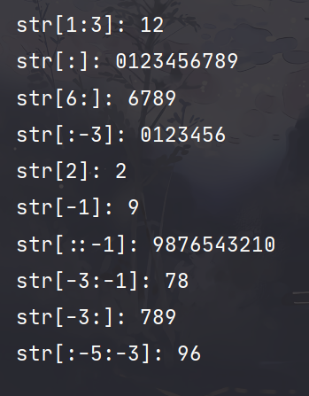

[TOC]

Python概述：python是一种简单易学、功能强大的编程语言，它继承了传统编译语言的强大性和通用性，具有高层次的数据结构，支持面向对象的编程方法。

### 1.Python的特点

1. Python是一门**跨平台的、开源的、免费的、解释型高级动态编程语言。是一种面向对象的语言。**

2. 因为Python是一种**解释型语言**[^1]，同时，也是一种**脚本语言**，写好代码即可直接运行，省去了**编译、链接**的一系列麻烦。不仅如此，Python还支持**交互**的操作方式，如果只是运行一段简单的小程序，连编译器都可以省略，直接输入即可运行。


3. Python是一种结构清晰的编程语言，使用**缩进**[^2]的方式来表示程序的嵌套关系。


4. Python和java的JDK一样拥有一个强大的基本类库和数量众多的第三方库。


### 2.Python语言基础

##### 2.1 标识符

Python标识符的命名规则如下：

1. 标识符长度无限制。
2. 标识符不能与**关健字重名**。
3. 字母**大小写敏感**。
4. 可以由字母、数字（不能开头）、下划线（不建议开头和结尾**同时**使用）[^3]、Unicode字符（含汉字）组成。


##### 2.2 Python语法和句法

Python语句中有一些基本规则和特殊字符：

1. `#`：表示其后的字符为python语句的注释。在python中，三引号也可以作为注释符。

   ```python
   #这是一行注释
   '''这也是一行注释'''
   """这还是一行注释"""
   ```

2. `\n` ：换行符

3. `\` ：续行符，继续上一行

   ```python
   print("This line is tooooooooo \
   long")
   ```

   关于续行符有两种例外情况：

   1. 一个语句在含有**小括号、中括号、花括号**时，可以多行书写：

      ```python
      print("this is a multiline",
            "example")
      #此时的缩进将失去语法上的意义。
      ```

   2. **三引号**内包含的字符串也可以跨行书写：

      ```python
      print('''hi there is a long message for you
      that goes over multiple lines!''')
      ```

4. `；` ：将两条语句放在一行中。python语句末尾不同于C语言，它不需要加分号，但是<u>如果多条语句放在一行就需要用分号将不同语句分开。</u>

   ```python
   a = 10; b = 20; print(a + b)
   ```

5. `：`： 将复合语句的头和体分开。

   像if， for， while，def和class之类的复合语句，首行均以关健字开始，并以冒号结束，该行之后的一行或多行代码就构成了代码块（组），即语句块。

   ```python
   if condition_1:
       statements_1
   elif condition_2:
       statements_2
   else:
       statements_3
   ```

6. 代码组用**缩进**的方式体现，不同的缩进深度分隔不同的代码块。

   一个代码组内的各行代码，左边必须有**数目相同的空格或数目相同的制表符**，而不能以一个制表符代替多个空格！

   随着缩进深度的增加，代码块的层次也在逐步加深，未缩进的代码块处于最高层次，称作脚本的**main部分**。

7. Python文件以**模块**的形式组织。

   每个python文件均可视为一个模块。模块可以包含直接运行的代码块，类定义，函数定义，以及他们的组合。


##### 2.3 数据类型

1. python3中有六种标准的**数据类型**，他们是：

   - 数值（Number）
   - 字符串（String）
   - 列表（List）
   - 元组（Tuple）
   - 字典（Dictionary）
   - 集合（Sets）

2. python3支持四种数值类型，他们是：

   - int（整数型）
   - float（浮点型）
   - bool（布尔型）
   - complex（复数型）

   **使用内建函数`type（）`来查询变量所指的对象的类型。**


##### 2.4  数值运算

python的数值运算包括加、减、乘、除四则运算以及取余、乘方运算等。

```python
>>> 5 + 4	#加法，注意这里及以下的运算均是命令行环境下演示的。
9

>>> 4.3 - 2	#减法
2.3

>>> 3 * 7	#乘法
21

>>>2 / 4	#除法，得到浮点数
0.5

>>> 6 // 4	#除法，得到整数（相当于C语言中的整数除法）
1

>>> 17 % 3	#取余
2

>>> 2 ** 5	#乘方
32

#在python中，++运算符不能用，但 += 可以用
```


##### 2.5 变量

1. Python中的**变量无需声明**，这一点与C语言不同，我们无需关心变量本身的数据类型，python有自己的判断机制。但是变量在使用前必须被赋值，变量赋值以后，该变量才会被创建。

2. **变量没有类型**，所谓的类型是指内存中对象的类型。也就是说，一个变量可以被赋值为各种类型的值。

3. python允许同时为多个变量赋值，例如： `a = b = c = 1`。但这个语句<u>只创建了一个整形对象</u>[^4]<u>，三个变量被分配到相同的内存空间上。</u>
   

   > 对上面的现象做一个解释：
   >
   > 首先引用[熊猫大哥大](https://blog.csdn.net/woshisangsang/article/details/69860201)博客中的一段话：“
   >
   > 那么看似牛X的Python变量是如何可以切换类型的呢，其实真正牛的不是Python变量，而是Python语言的解释执行器。
   >
   > 举个例子如下，解释器可以这么运作。首先在内存中地址为XXXX的地方存了一个变量1，然后运行到a=1时，发现整数1要赋值给变量a，所以解释器就知道了啊哈变量a是整型，然后a其实保存的是地址XXXX。
   >
   > 然后运行到a=0.1，解释执行器在内存中地址为YYYY的地方存了0.1，然后知道了啊哈a是浮点类型，然后a保存的地址变为了YYYY。”
   >
   > **所以，python中的变量的地址是在不断变化的，他不是固定的，随着对象的地址的变化而变化。它不像C语言中的变量那样有一个固定的地址值。**

   ```python
   a = b = c = 1
   print("a的地址：", id(a))
   print("b的地址：", id(b))
   print("c的地址：", id(c))
   ```

   

4. python可以为多个对象指定多个变量。例如： `a, b, c = 1, 2, "python"`。这也为变量交换数值提供了一种新的解决方法： `a, b = b, a `。

5. 变量赋值时，只会记住**最后一次**赋值的值。


##### 2.6 常量

常量与变量相对应，就是程序运行中不可改变的量。例如：

```python
PI = 3.1415926
```

但实际上，python并没有严格意义的常量，编程时主动不修改的变量也就伪装成了常量。我们通常以**全部大写**来标识常量，提醒我们这是一个常量，但实际上它还是可以修改的。


##### 2.7 字符串

1. python使用**引号**（单引号或双引号）作为字符串的定界符（一般为单行字符串，多行字符串用**三引号**）。

   ```python
   var1 = "hello world"
   var2 = 'hello world'
   var3 = '''hello
   				world'''  #会保留这种格式
   var4 = '"hello world"'	  #单引号内可以使用双引号，此时的双引号被视为一个字符。
   ```

2. 一个字符串用什么引号开头，就得用什么结尾。

3. 字符串的切片运算，使用的运算符是方括号（[]或[:]或[i:j:k]）。i为起始位置默认从零开始，j为终止位置，k为步长。

   ```python
   str = '0123456789'
   print("str[0:3]:", str[0:3])		#截取第0位到第3位但不包括第3位的字符
   print("str[:]:", str[:])			#截取全部字符
   print("str[6:]:", str[6:])			#截取第6位（0开始）到末尾的字符
   print("str[:-3]:", str[:-3])		#截取第0位到倒数第3位但不包括倒数第3位的字符
   print("str[2]:", str[2])			#截取第2位字符（0开始）
   print("str[-1]:", str[-1])			#截取倒数第1位字符
   print("str[::-1]:", str[::-1])		#倒序字符
   print("str[-3:-1]:", str[-3:-1])	#截取倒数第3位到倒数第1位但不包括倒数第1位的字符
   print("str[-3:]:", str[-3:])		#截取倒数第3位到结尾
   print("str[:-5:-3]:", str[:-5:-3])	#逆序截取，步长为3，到倒数第5为不包括倒数第5位
   ```

   运行结果如下：

   

   

4. python字符串的更新

   不能通过切片运算来更新已有的字符串，例如：

   ```python
   str = '0123'
   str[0] = 2
   #不能达到str = '2123'的效果
   ```

   必需使用 `replace()` 函数来实现字符串的更新，例如：

   ```python
   str = '0123'
   str = str.replace('0', 'a')
   print(str)
   ```

   ```
   >>>'a123'
   ```

5. 字符串运算符

   | 操作符 |                      描述                      |
   | :----: | :--------------------------------------------: |
   |   +    |                   字符串连接                   |
   |   *    |                 重复输出字符串                 |
   |   []   |           通过索引获取字符串中的字符           |
   |  [::]  |                    切片字符                    |
   |   in   |  成员运算符——如果字符串包含所给字符，返回True  |
   | not in | 成员运算符——如果字符串不包含所给字符，返回True |
   |  r/R   |                   原始字符串                   |
   |   %    |                  格式化字符串                  |

6. python字符串的格式化

```python
#格式化的基本语法

#第一种：
print("我叫%s, 今年%d岁！" % ('张三', 20))

#第二种：
value = {'name': 'Tim', 'age': 20}
print("我叫%(name)s，今年%(age)d岁！" % value)

#第三种：(suggest)
print("我叫{name}，今年{age}岁！" .format(name = 'Tim', age = 20))
```


<center><b>格式化符号</b></center>

| 符号 | 描述                           |
| ---- | ------------------------------ |
| %c   | 格式化字符及ASCII码            |
| %s   | 格式化字符串                   |
| %d   | 格式化整型数                   |
| %u   | 格式化无符号整数               |
| %o   | 格式化无符号八进制数           |
| %x   | 格式化无符号十六进制数         |
| %X   | 格式化无符号十六进制数（大写） |
| %f   | 格式化浮点数，可指定精度       |
| %e   | 科学计数法格式化浮点数         |
| %E   | 同%e                           |
| %g   | 按%f和%e中较短者输出           |
| %G   | 按%f和%E中较短者输出           |
| %p   | 用十六进制数格式化变量地址     |


##### 2.8 序列与列表


[^1]: 解释型语言通常很慢。虽然python是一种解释型语言，但实际上也可以编译，即把python程序编译成一种特殊的ByteCode

[^2]: Python将缩进提升到了语法的高度。

[^3]: 不要在名字的开头和结尾都使用下划线，因为python中大量采用这种名字定义各种特殊的方法和变量。

[^4]: python中的一切事物皆为对象，并且规定参数的传递都是对象的调用，对象的赋值实际上就是对象的引用。

